# Building Serverless Vulnerability Scanning for AWS Lambda Functions

Serverless computing has fundamentally changed how organizations deploy and scale applications. AWS Lambda, the most widely adopted serverless compute platform, now powers millions of workloads across industries. But with this shift comes a new security challenge: how do you scan ephemeral, event-driven functions for vulnerabilities when there is no traditional infrastructure to attach an agent to?

This post explores the technical architecture behind agentless vulnerability scanning for AWS Lambda, walking through the design decisions, component interactions, and implementation patterns that make it possible to scan serverless workloads at scale.

## The Challenge with Serverless Security

Traditional vulnerability scanning relies on agents installed on hosts or containers. These agents run continuously, monitoring file systems and reporting back to centralized management consoles. This model breaks down with Lambda for several reasons:

**No persistent compute**: Lambda functions execute in response to events and terminate when idle. There is no long-running process to host a scanning agent.

**Ephemeral file systems**: The `/tmp` directory is the only writable space, and it gets wiped between invocations unless the execution environment is reused.

**Cold start sensitivity**: Adding heavy dependencies to Lambda packages increases cold start latency, directly impacting user experience and costs.

**Scale dynamics**: A single AWS account might have hundreds or thousands of Lambda functions, each potentially running different runtimes and dependencies.

The solution is agentless scanning, where the scanner runs externally and pulls function code for analysis rather than running inside the function itself.

## Architecture Overview

The scanning architecture consists of several AWS services working together to detect Lambda changes, trigger scans, and store results. Here is the high-level flow:

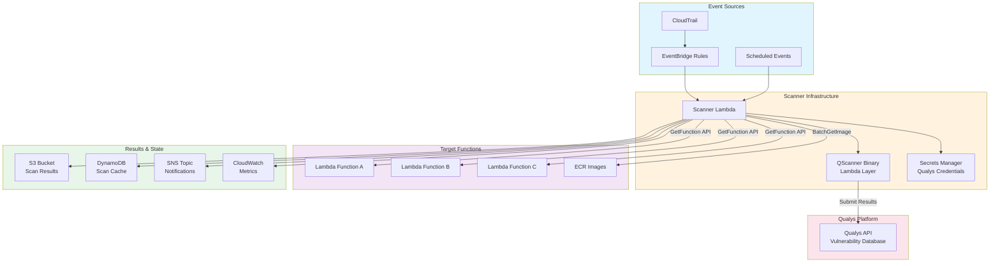

## Event-Driven Trigger Architecture

The system needs to detect when Lambda functions are created or modified. AWS CloudTrail logs all API calls to Lambda, and EventBridge can filter these events and route them to our scanner.

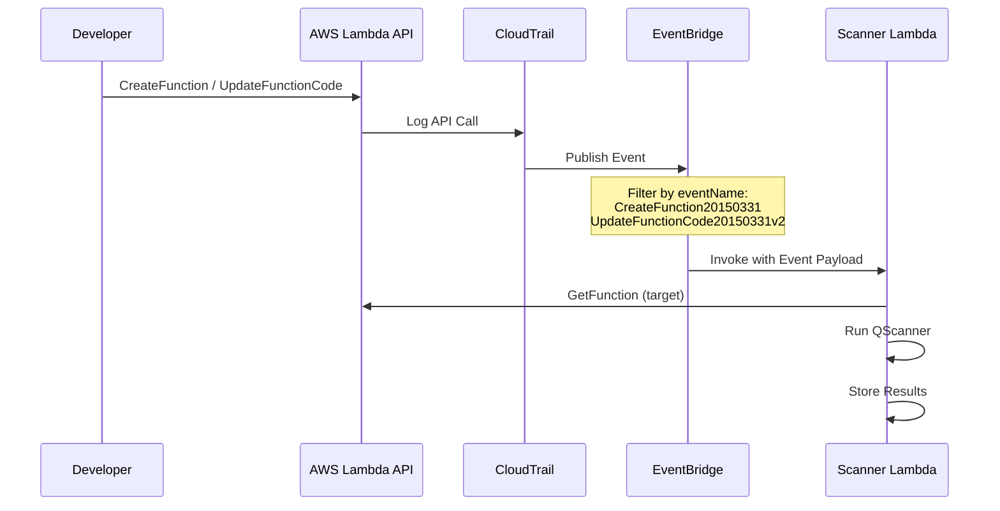

The EventBridge rules are configured to match specific CloudTrail event patterns:

```json
{
  "source": ["aws.lambda"],
  "detail-type": ["AWS API Call via CloudTrail"],
  "detail": {
    "eventSource": ["lambda.amazonaws.com"],
    "eventName": [
      "CreateFunction20150331",
      "UpdateFunctionCode20150331v2"
    ]
  }
}
```

This pattern captures both new function deployments and code updates to existing functions. Configuration-only updates can optionally trigger scans as well, though the code hash will typically remain unchanged.

## Scanner Lambda Internals

The scanner Lambda function is the core component. It receives event payloads from EventBridge, retrieves target function code, executes the vulnerability scanner, and distributes results.

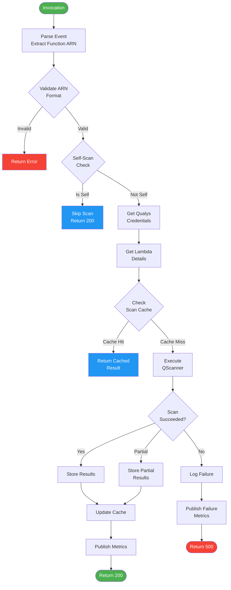

### Code Retrieval

For zip-packaged Lambda functions, the scanner calls the `GetFunction` API which returns a presigned S3 URL to download the deployment package. The scanner does not need to invoke the target function; it only reads the static code package.

For container image-based Lambda functions, the scanner authenticates with ECR using `GetAuthorizationToken` and pulls the image layers using standard registry APIs. This allows scanning of both the base image and any added application layers.

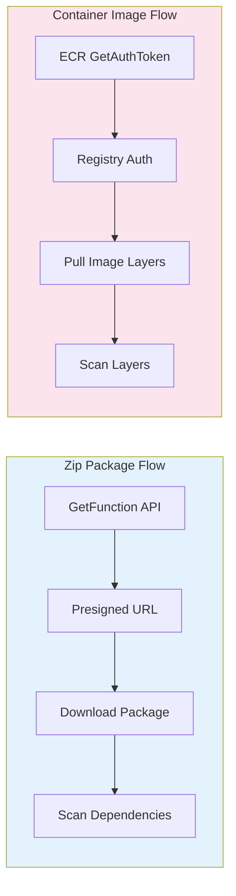

## Scan Caching Architecture

Scanning the same unchanged code repeatedly wastes compute resources. The architecture includes a DynamoDB-based cache that tracks which function and code combinations have been scanned.

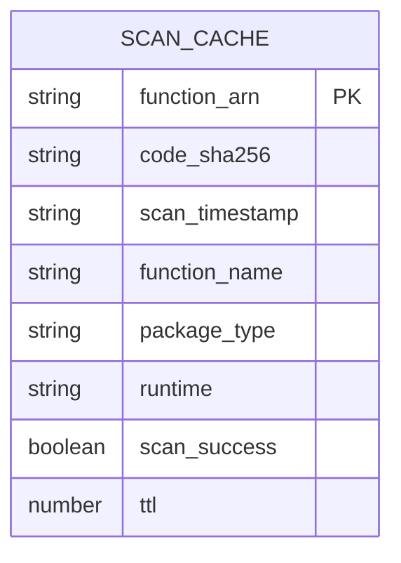

The cache key is the function ARN, and the stored code_sha256 is compared against the current function's hash. If they match and the scan is within the TTL window (default 30 days), the scanner returns early without running a new scan.

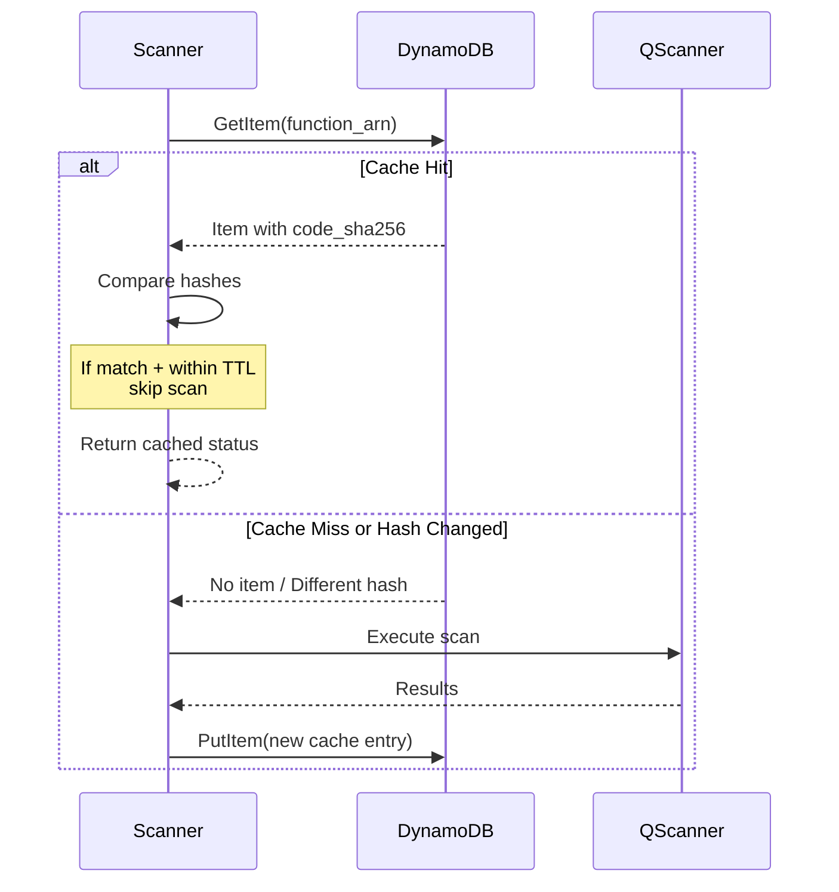

## Security Model

The scanner requires carefully scoped IAM permissions. It needs read access to target Lambda functions but should not be able to invoke or modify them beyond adding Qualys-specific tags.

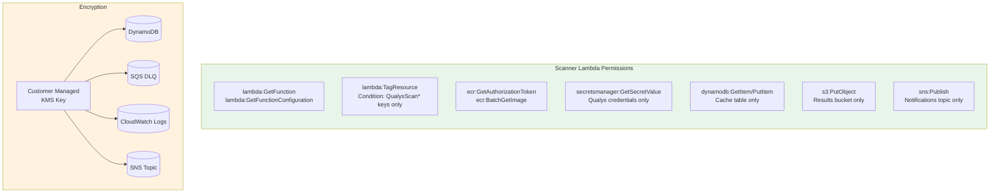

All data at rest is encrypted using a customer-managed KMS key. This includes DynamoDB items, SQS dead letter queue messages, CloudWatch logs, and SNS notifications. The key policy restricts usage to the specific services that need it.

### Cross-Account Scanning

For organizations with multiple AWS accounts, the scanner supports assuming a role in target accounts:

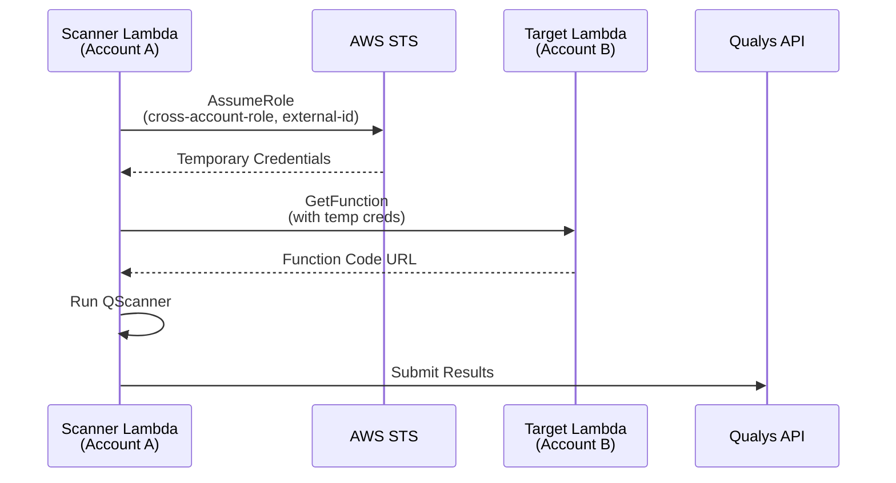

## Results Distribution

Scan results flow to multiple destinations depending on the use case:

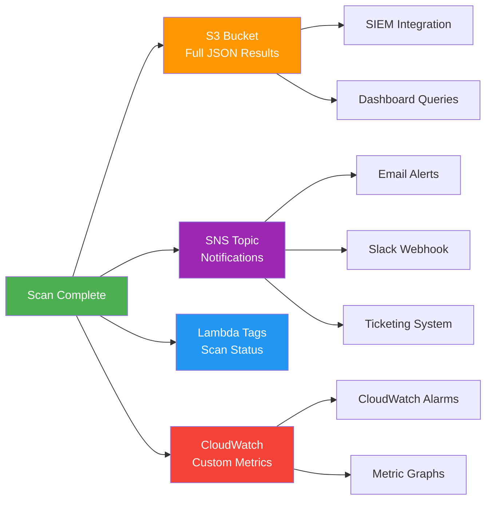

**S3 Storage**: Full scan results in JSON format, organized by function name and timestamp. Lifecycle policies automatically expire old results.

**SNS Notifications**: Summary messages suitable for alerting pipelines. Subscribers can filter by message attributes to route critical vulnerabilities differently than informational findings.

**Lambda Tags**: The target function is tagged with `QualysScanTimestamp` and `QualysScanStatus` for quick visibility in the AWS Console.

**CloudWatch Metrics**: Custom metrics track scan success rates, durations, cache hit ratios, and vulnerability counts. These power operational dashboards and alarms.

## Bulk Scanning Existing Functions

New deployments are captured by EventBridge, but existing functions need an initial scan. A separate bulk scan Lambda enumerates all functions in the account and invokes the scanner for each:

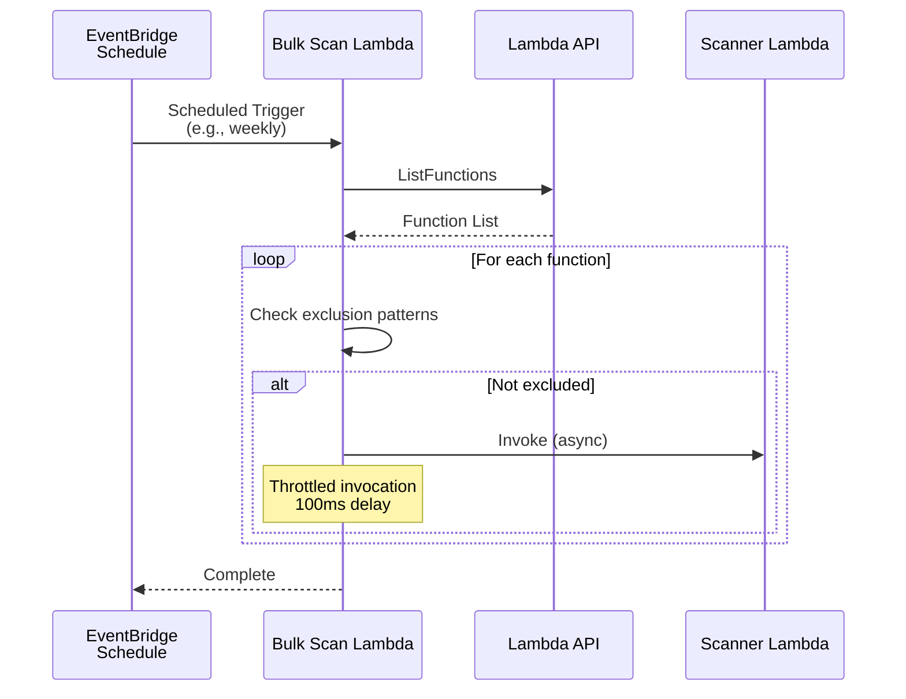

The bulk scanner respects exclusion patterns to skip infrastructure functions (like itself and the scanner) and implements rate limiting to avoid overwhelming the scanner or hitting Lambda concurrency limits.

## Deployment Architecture

The infrastructure can be deployed via CloudFormation or Terraform. Here is the resource topology:

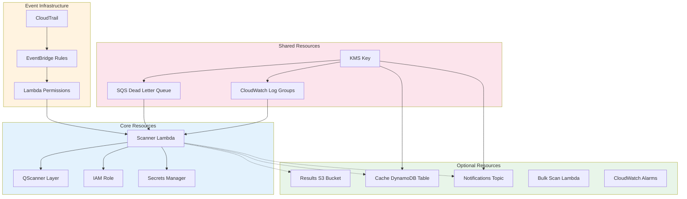

### Configuration Parameters

Key deployment parameters include:

| Parameter | Description | Default |
|-----------|-------------|---------|
| ScannerMemorySize | Memory allocation for scanner Lambda | 2048 MB |
| ScannerTimeout | Maximum scan duration | 900 seconds |
| EphemeralStorage | Temp storage for downloaded packages | 2048 MB |
| CacheTTLDays | How long to cache scan results | 30 days |
| EnableTagging | Tag scanned functions with status | true |
| BulkScanSchedule | Cron expression for periodic scans | (manual) |

## Monitoring and Observability

The architecture includes built-in monitoring through CloudWatch alarms:

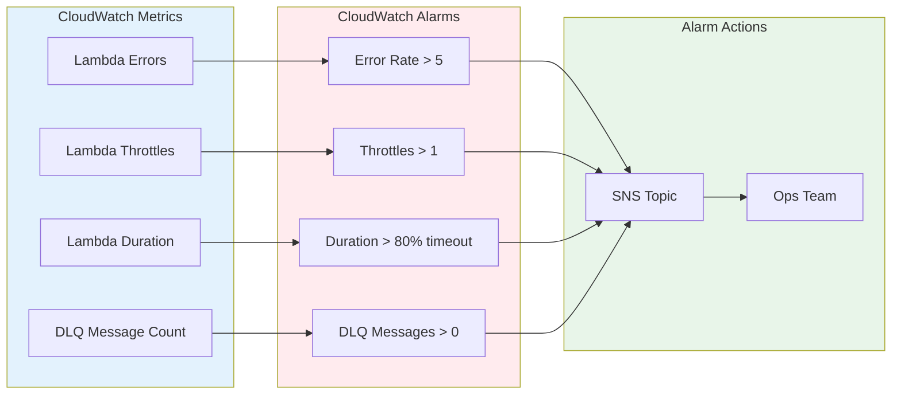

Custom metrics published by the scanner provide additional visibility:

- **ScanSuccess / ScanPartialSuccess**: Track scan completion rates
- **ScanDuration**: Monitor performance trends
- **CacheHit**: Measure cache effectiveness
- **VulnerabilityCount**: Aggregate vulnerability metrics

## Performance Considerations

Several design choices optimize for performance at scale:

**Reserved Concurrency**: Setting a reserved concurrency limit (e.g., 10) prevents the scanner from consuming all available Lambda concurrency during bulk operations.

**Ephemeral Storage**: Large function packages and container images require substantial temp space. The default 512 MB is often insufficient; 2048 MB handles most workloads.

**Memory Allocation**: Higher memory allocations provide proportionally more CPU. The scanner benefits from 2048 MB or higher for CPU-intensive vulnerability analysis.

**Caching**: The DynamoDB cache eliminates redundant scans. With a 30-day TTL and code hash validation, only actual code changes trigger new scans.

## Conclusion

Agentless vulnerability scanning for serverless workloads requires rethinking traditional security patterns. By leveraging CloudTrail for change detection, EventBridge for event routing, and Lambda for compute, the architecture achieves continuous security monitoring without impacting application performance.

The design prioritizes minimal permissions, encryption at rest, and operational visibility. Optional components like caching and bulk scanning address real-world operational needs while keeping the core architecture simple.

Organizations adopting serverless should treat vulnerability scanning as a first-class concern, not an afterthought. The patterns described here provide a foundation for building or evaluating serverless security tooling.
