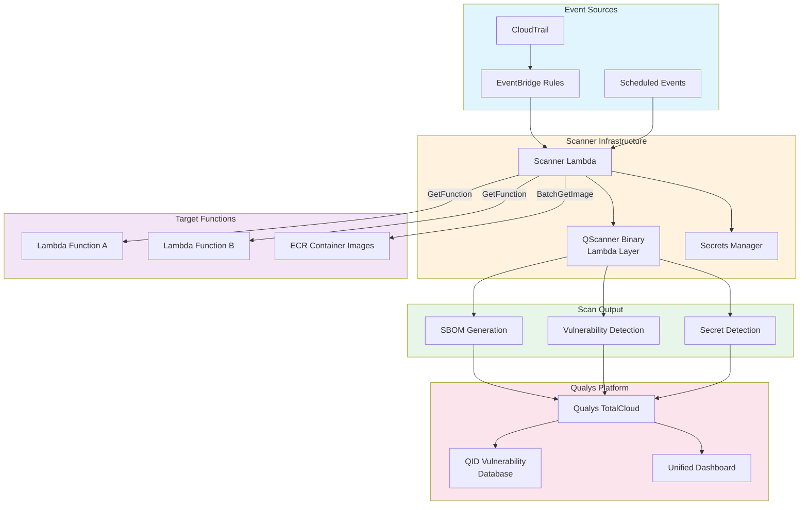
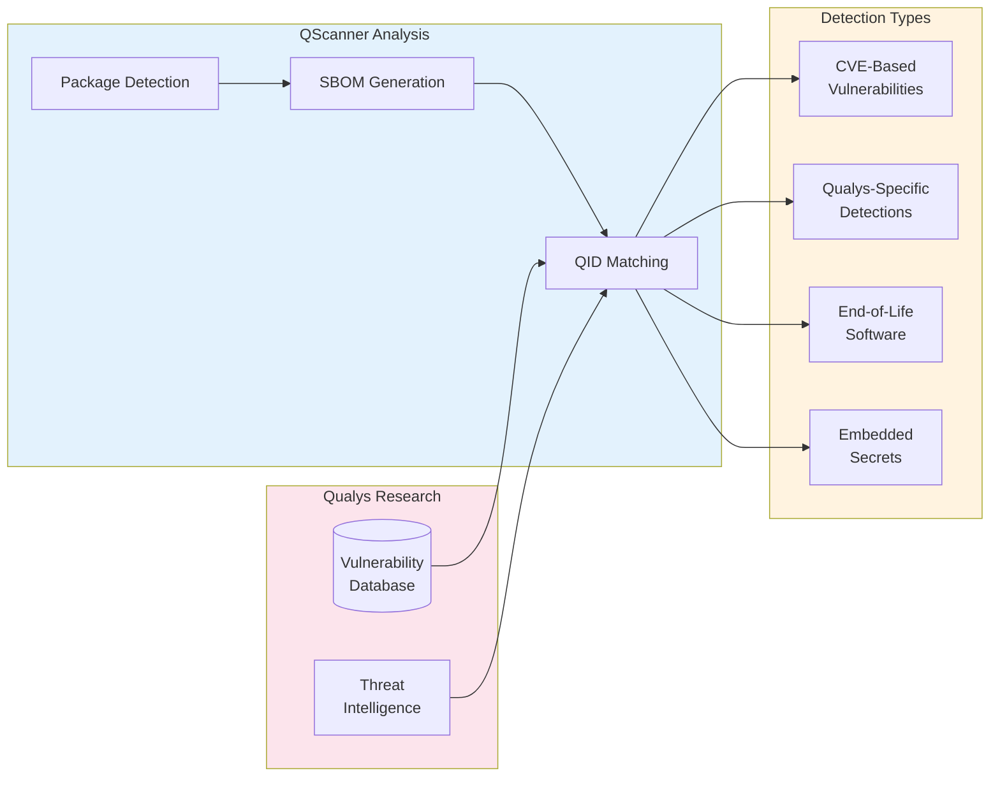
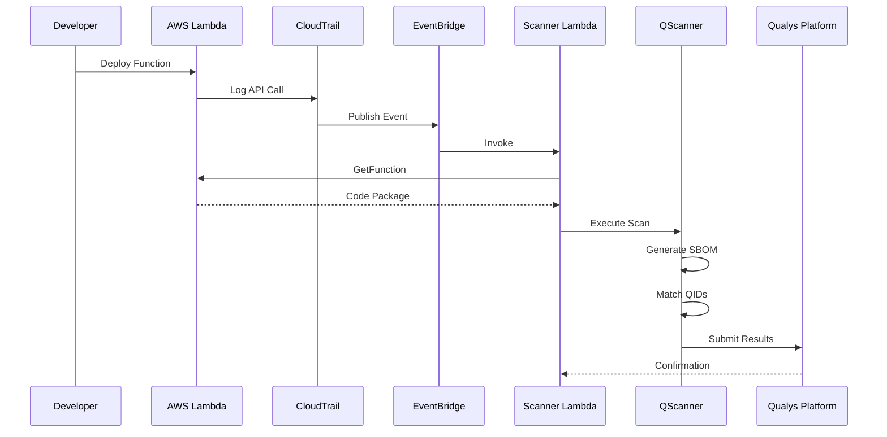
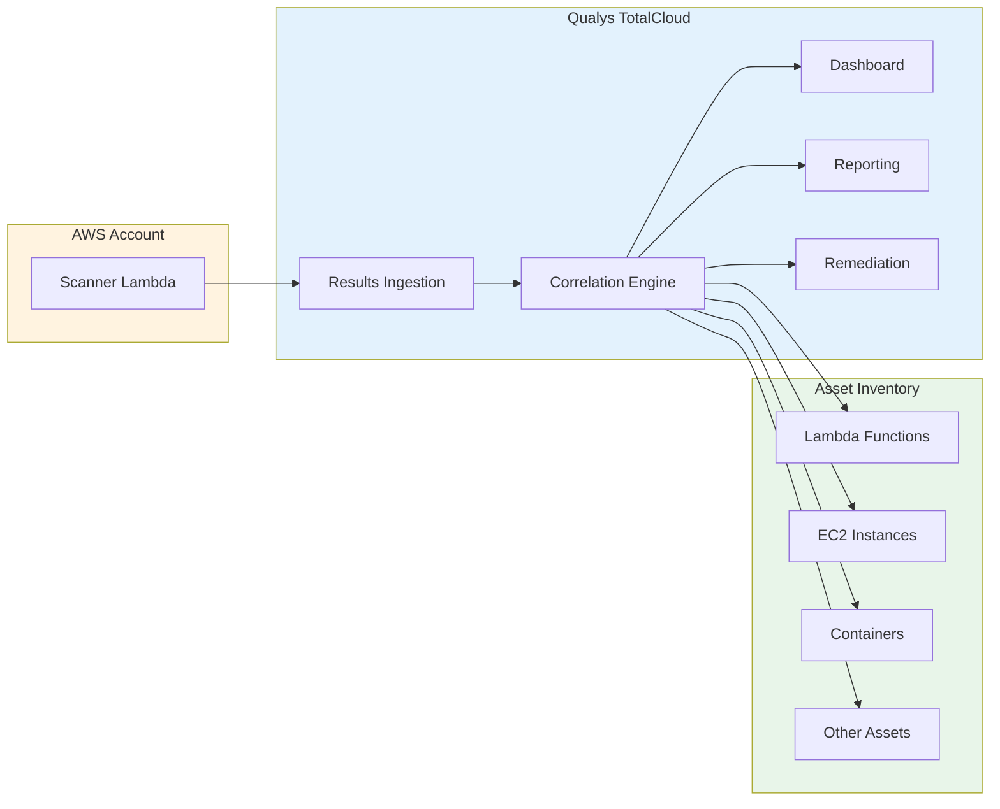
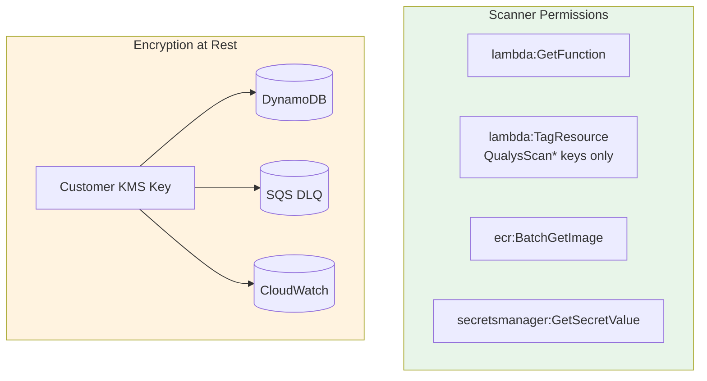
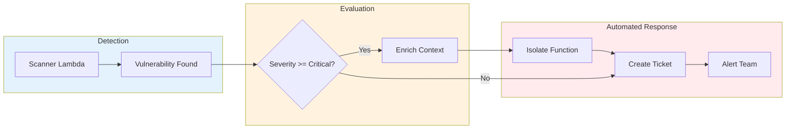

# Agentless Vulnerability Scanning and Automated Response for AWS Lambda with Qualys

When Log4Shell emerged in December 2021, security teams scrambled to identify every vulnerable component across their infrastructure. For traditional servers, this meant running agents and scanning filesystems. But for serverless workloads, the standard playbook failed—there is no persistent infrastructure to host an agent.

AWS Lambda processes trillions of invocations monthly across millions of active functions. Each function packages application code with dependencies, base images, and configuration that may contain vulnerabilities. The security challenge is not the function's execution model—it is gaining visibility into the software supply chain without access to traditional scanning infrastructure.

This post examines the technical architecture behind agentless Lambda scanning powered by Qualys QScanner—how it detects changes, analyzes function code, and delivers continuous security visibility without impacting function performance.

## The Serverless Security Challenge

Traditional vulnerability scanning relies on persistent agents running on host operating systems. This model fails with Lambda for several reasons:

- **Ephemeral compute**: Function execution environments exist only during invocation—there is no persistent host to install an agent
- **Read-only file systems**: Lambda restricts write access to `/tmp`, preventing agent installation or updates
- **Cold start sensitivity**: Any agent overhead directly impacts function latency and user experience
- **Dynamic scale**: Functions scale from zero to thousands of concurrent instances, making per-instance agents impractical

The solution is agentless scanning where an external scanner retrieves and analyzes function code without executing inside the target function.

## Architecture Overview

The architecture combines AWS event services with Qualys QScanner to detect Lambda changes and scan functions automatically:



## Qualys QScanner Capabilities

QScanner is the scanning engine at the core of this architecture. It is a standalone command-line utility that requires no installation—download the binary and start scanning.

Deployed as a Lambda layer, QScanner provides the `function` command designed for scanning serverless workloads across cloud providers, including AWS Lambda, GCP Cloud Run, and Azure Function Apps.

For AWS Lambda specifically, QScanner downloads the function's deployment package via the GetFunction API or authenticates with ECR for container-based functions. The scanner analyzes extracted contents without ever invoking the target function.

### Software Bill of Materials Generation

QScanner generates a complete Software Bill of Materials (SBOM) for each Lambda function in multiple industry-standard formats:

- **SPDX JSON** (v2.3): Machine-readable format for automated tooling integration
- **SPDX Tag-Value**: Human-readable SPDX format for documentation
- **CycloneDX** (v1.6): Lightweight format designed for security use cases

The SBOM captures all detected packages, their versions, and relationships. For Lambda functions, QScanner analyzes both zip-based deployments and container images, providing visibility into the complete software supply chain.

### Vulnerability Detection with QIDs

Qualys maintains one of the industry's most comprehensive vulnerability databases, with each vulnerability assigned a unique Qualys ID (QID). QScanner maps discovered packages against this database to identify:

- Known CVEs affecting installed package versions
- Qualys-specific vulnerability detections not yet assigned CVEs
- Version-specific security advisories
- End-of-life software with no available patches

The QID system enables precise vulnerability tracking across the enterprise. Security teams can search, filter, and report on specific QIDs across all scanned assets, whether they are Lambda functions, containers, or traditional servers.



### Secret Detection

QScanner scans Lambda function code to detect exposed secrets using configurable rule-based detection. Each rule defines a regex pattern, severity level, and category. Detected secrets include:

- API keys and access tokens
- Database connection strings
- Private keys and certificates
- Cloud provider credentials

Secret detection is disabled by default and enabled via the `--scan-types pkg,secret` flag. Rules can be customized through a JSON configuration file or downloaded from the Qualys backend. Detection results include the file path, line number, and rule category without exposing the actual secret content.

### Multi-Runtime Support

QScanner performs Software Composition Analysis (SCA) across all major Lambda runtimes. For Lambda functions specifically, QScanner analyzes post-build artifacts:

| Language | Detected Files |
|----------|----------------|
| Python | wheel packages, egg packages, conda packages |
| Node.js | package.json |
| Java | JAR/WAR/PAR/EAR files |
| Go | Go binaries |
| .NET | packages.lock.json, packages.config, deps.json |
| Ruby | gemspec files |
| Rust | Cargo.lock, binaries built with cargo auditable |
| PHP | installed.json |
| Dart | pubspec.lock |

For container image-based Lambda functions, QScanner performs full image layer analysis. It scans both the base image OS packages and application layers, detecting vulnerabilities across the entire stack.

## Event-Driven Trigger Architecture

CloudTrail captures Lambda API calls, and EventBridge routes relevant events to the scanner:



EventBridge rules filter for specific CloudTrail events:

```json
{
  "source": ["aws.lambda"],
  "detail-type": ["AWS API Call via CloudTrail"],
  "detail": {
    "eventSource": ["lambda.amazonaws.com"],
    "eventName": ["CreateFunction20150331", "UpdateFunctionCode20150331v2"]
  }
}
```

## Scanner Processing Flow

The scanner Lambda orchestrates the scan process:


### Code Retrieval

For zip packages, the scanner calls GetFunction to obtain a presigned S3 URL for the deployment package. For container images, it authenticates with ECR and pulls image layers. Neither approach requires invoking the target function.

### Scan Caching

A DynamoDB table caches scan results keyed by function ARN and code SHA256. Unchanged functions skip scanning, reducing compute costs and API calls.

## Integration with Qualys TotalCloud

Scan results flow directly into the Qualys TotalCloud platform, providing:

**Unified Visibility**: Lambda vulnerabilities appear alongside findings from EC2, containers, and other cloud assets in a single dashboard.

**QID-Based Tracking**: Security teams can track specific vulnerabilities across all asset types using consistent QID references.

**Compliance Reporting**: Scan results feed into compliance frameworks and audit reports.

**Remediation Workflows**: Integration with ticketing systems and remediation tracking.



## Security Model

The scanner operates with minimal IAM permissions:



All data at rest uses customer-managed KMS encryption. The scanner cannot invoke or modify target functions beyond adding scan status tags.

## Deployment Options

Infrastructure deploys via CloudFormation or Terraform with configurable parameters:

| Parameter | Description | Default |
|-----------|-------------|---------|
| ScannerMemorySize | Lambda memory allocation | 2048 MB |
| ScannerTimeout | Maximum scan duration | 900 seconds |
| CacheTTLDays | Scan result cache duration | 30 days |
| EnableTagging | Tag functions with scan status | true |
| BulkScanSchedule | Periodic full-account scan | manual |

## Automated Response with QFlow

Detecting vulnerabilities is only half the problem. The time between discovery and remediation represents active risk exposure—and at 2 AM on a Saturday, no one is watching the dashboard.

QFlow, the workflow automation engine in Qualys TotalCloud, bridges this gap. When the scanner identifies a vulnerability exceeding defined severity thresholds, QFlow executes predefined response actions without waiting for human intervention.



### Lambda Isolation Techniques

QFlow supports three isolation methods for vulnerable Lambda functions, each appropriate for different risk levels:

**Concurrency Control**: Setting a function's reserved concurrency to zero prevents any new invocations while preserving the function's code and configuration for investigation. This is analogous to taking a server offline without destroying forensic evidence.

```bash
# QFlow executes this via AWS SDK
aws lambda put-function-concurrency \
    --function-name $FUNCTION_NAME \
    --reserved-concurrent-executions 0
```

**Permission Restriction**: For higher-severity findings, QFlow can attach a deny-all policy to the function's execution role. Even if the function somehow executes, it cannot access AWS services or data.

**Network Isolation**: For VPC-attached functions, QFlow moves the function to a quarantine security group with no ingress or egress rules, severing all network connectivity and limiting lateral movement.

### Building Response Playbooks

QFlow's no-code interface lets security teams build response playbooks without scripting. Drag-and-drop nodes define the workflow: detection triggers, context enrichment, remediation actions, and stakeholder notifications. Over 200 pre-built playbooks provide starting templates.

The separation of concerns is key: security teams define response policies centrally, developers continue deploying normally, and QFlow enforces the rules automatically. Mean time to contain drops from days to minutes.

## CI/CD Integration and Policy Enforcement

Beyond runtime scanning, QScanner integrates directly into CI/CD pipelines to shift security left. The scanner supports multiple output formats for pipeline integration:

**SARIF Output**: QScanner generates SARIF (Static Analysis Results Interchange Format) reports compatible with GitHub Advanced Security, GitLab SAST, and other security dashboards. Vulnerabilities appear directly in pull request annotations.

**Policy Evaluation**: Security teams define policies centrally through the Qualys Portal—vulnerability severity thresholds, package blocklists, or compliance requirements. QScanner evaluates scans against these policies and returns pass/fail exit codes:

```bash
# Scan and evaluate against policies tagged for production workloads
qscanner --pod US1 --mode evaluate-policy --policy-tags production function $FUNCTION_ARN

# Exit code 0: policy passed, deployment proceeds
# Exit code 42: policy failed (DENY), block the pipeline
# Exit code 43: no matching policies evaluated (AUDIT)
```

**GitLab and GitHub Actions**: Native integration allows vulnerability findings to flow into existing security workflows without custom scripting. Teams can gate deployments on scan results while security maintains centralized policy control.

This separation of concerns—developers deploy, security defines policy, tooling enforces—enables shift-left security without slowing delivery velocity.

## Conclusion

Serverless security requires a fundamentally different approach than traditional vulnerability management. You cannot install agents on infrastructure you do not control. The solution is agentless scanning that retrieves and analyzes function code externally—providing the same depth of vulnerability detection without the deployment constraints.

The architecture presented here combines AWS event-driven services with Qualys QScanner and QFlow to deliver:

- **Continuous visibility**: Every function deployment triggers automatic scanning
- **Comprehensive detection**: OS packages, application dependencies, and embedded secrets across all major runtimes
- **Automated response**: QFlow isolates vulnerable functions within minutes, not days
- **Unified management**: Lambda vulnerabilities appear alongside EC2, containers, and other cloud assets in Qualys TotalCloud
- **Shift-left integration**: Policy enforcement in CI/CD pipelines catches vulnerabilities before deployment

With QScanner's `function` command supporting AWS Lambda, GCP Cloud Run, and Azure Function Apps, the same approach covers your entire serverless footprint. Security teams gain consistent visibility regardless of which cloud provider hosts the workload.

The next time a critical vulnerability like Log4Shell emerges, organizations running this architecture will know within minutes which Lambda functions are affected. QFlow will isolate critical findings automatically. And policy controls will prevent vulnerable code from deploying in the first place. Detection, response, and prevention—all without installing a single agent.

## Getting Started

To implement agentless Lambda scanning in your environment:

1. **Download QScanner** from the Qualys Portal and test locally against a sample function
2. **Deploy the scanner infrastructure** using the provided CloudFormation or Terraform templates
3. **Configure EventBridge rules** to trigger scans on function deployments
4. **Set up QFlow playbooks** to automate response actions for critical findings
5. **Integrate with CI/CD** by adding QScanner to your build pipelines with policy evaluation

For detailed implementation guides and API documentation, visit the [Qualys TotalCloud documentation](https://docs.qualys.com/en/tc/latest/) or contact your Qualys representative.
