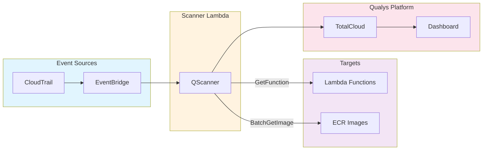
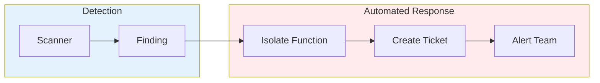

# Agentless Vulnerability Scanning for AWS Lambda with Qualys QScanner

When a critical vulnerability drops, security teams have hours to identify which systems are affected. For traditional servers, incident response means running agents and scanning filesystems. But for serverless workloads, the standard playbook fails. There is no persistent infrastructure to host an agent.

AWS Lambda processes trillions of invocations monthly across millions of active functions. Each function packages application code with dependencies that may contain vulnerabilities. The question isn't whether your Lambda functions have vulnerable dependencies. It's whether you can find them before attackers do.

This post explores how Qualys QScanner delivers continuous vulnerability visibility for serverless workloads without agents, without performance impact, and without gaps in coverage.

## The Serverless Security Challenge

Traditional vulnerability scanning relies on persistent agents running on host operating systems. This model breaks down with Lambda:

- **Ephemeral compute**: Execution environments exist only during invocation, so there is no persistent host for an agent
- **Read-only filesystems**: Lambda restricts write access, preventing agent installation
- **Cold start sensitivity**: Any agent overhead directly impacts function latency
- **Dynamic scale**: Functions scale from zero to thousands of instances, making per-instance agents impractical

The solution is agentless scanning. An external scanner retrieves and analyzes function code without executing inside the target function.

## How QScanner Works

QScanner is a standalone command-line utility that requires no installation. Download the binary and start scanning. For Lambda specifically, QScanner's `function` command retrieves deployment packages via the GetFunction API or authenticates with ECR for container-based functions, then analyzes the contents without ever invoking the target.



When a developer deploys or updates a Lambda function, CloudTrail logs the API call. EventBridge routes the event to your scanner Lambda, which executes QScanner against the target. Results flow directly to Qualys TotalCloud, where Lambda vulnerabilities appear alongside findings from EC2, containers, and other cloud assets.

## Key Capabilities

### Software Bill of Materials

QScanner generates a complete SBOM for each function in industry-standard formats including SPDX JSON, SPDX Tag-Value, and CycloneDX. The SBOM captures all detected packages, versions, and relationships, providing visibility into your complete software supply chain.

### Vulnerability Detection with QIDs

Qualys maintains one of the industry's most comprehensive vulnerability databases. Each vulnerability is assigned a unique Qualys ID (QID), enabling precise tracking across the enterprise. QScanner maps discovered packages against this database to identify:

- Known CVEs affecting installed package versions
- Qualys-specific detections not yet assigned CVEs
- End-of-life software with no available patches

Security teams can search, filter, and report on specific QIDs across all scanned assets, whether Lambda functions, containers, or traditional servers.

### Secret Detection

QScanner identifies exposed secrets in function code using configurable rule-based detection: API keys, database connection strings, private keys, and cloud credentials. Results include file path and line number without exposing actual secret content.

### Multi-Runtime Support

QScanner performs Software Composition Analysis across all major Lambda runtimes:

| Runtime | Detected Artifacts |
|---------|-------------------|
| Python | wheel, egg, conda packages |
| Node.js | package.json |
| Java | JAR/WAR/EAR files |
| Go | Go binaries |
| .NET | packages.lock.json, deps.json |
| Rust | Cargo.lock, cargo-auditable binaries |

For container-based functions, QScanner performs full image layer analysis, scanning both base image OS packages and application layers.

## Automated Response with QFlow

Detecting vulnerabilities is only half the problem. The time between discovery and remediation represents active risk exposure. At 2 AM on a Saturday, no one is watching the dashboard.

QFlow, the workflow automation engine in Qualys TotalCloud, bridges this gap. When the scanner identifies a critical vulnerability, QFlow executes predefined response actions automatically.



### Lambda Isolation Techniques

QFlow supports three isolation methods for vulnerable functions:

**Concurrency Control**: Setting reserved concurrency to zero prevents new invocations while preserving code for investigation. Think of it as taking a server offline without destroying forensic evidence.

```bash
aws lambda put-function-concurrency \
    --function-name $FUNCTION_NAME \
    --reserved-concurrent-executions 0
```

**Permission Restriction**: For critical findings, QFlow attaches a deny-all policy to the execution role. Even if the function somehow executes, it cannot access AWS services or data.

**Network Isolation**: For VPC-attached functions, QFlow moves the function to a quarantine security group with no ingress or egress rules.

QFlow's no-code interface lets security teams build response playbooks using drag-and-drop nodes. Over 200 pre-built playbooks provide starting templates. Mean time to contain drops from days to minutes.

## CI/CD Integration

Beyond runtime scanning, QScanner integrates directly into CI/CD pipelines to shift security left.

**SARIF Output**: QScanner generates SARIF reports compatible with GitHub Advanced Security and GitLab SAST. Vulnerabilities appear directly in pull request annotations, so developers see findings before code reaches production.

**Policy Enforcement**: Security teams define policies centrally through the Qualys Portal. QScanner evaluates scans against these policies and returns pass/fail exit codes:

```bash
qscanner --pod US1 --mode evaluate-policy --policy-tags production function $FUNCTION_ARN

# Exit code 0: policy passed, deployment proceeds
# Exit code 42: policy failed, block the pipeline
```

This separation of concerns lets developers deploy, security define policy, and tooling enforce. Shift-left security without slowing delivery velocity.

## Getting Started

To implement agentless Lambda scanning in your environment:

1. **Download QScanner** from the Qualys Portal and test locally against a sample function
2. **Deploy scanner infrastructure** using CloudFormation or Terraform templates
3. **Configure EventBridge rules** to trigger scans on function deployments
4. **Set up QFlow playbooks** for automated response to critical findings
5. **Integrate with CI/CD** by adding policy evaluation to your build pipelines

For implementation guides and API documentation, visit the [Qualys TotalCloud documentation](https://docs.qualys.com/en/tc/latest/).

## Conclusion

Serverless security requires a fundamentally different approach. You cannot install agents on infrastructure you do not control. The solution is agentless scanning that retrieves and analyzes function code externally, providing the same depth of vulnerability detection without the deployment constraints.

The architecture presented here combines AWS event-driven services with Qualys QScanner and QFlow to deliver continuous visibility, automated response, and shift-left integration. With QScanner's `function` command supporting AWS Lambda, GCP Cloud Run, and Azure Function Apps, the same approach covers your entire serverless footprint.

The next time a critical vulnerability or supply chain compromise emerges, organizations running this architecture will know within minutes which functions are affected. QFlow will isolate critical findings automatically. And policy controls will prevent vulnerable code from deploying in the first place.

Detection, response, and prevention. All without installing a single agent.
