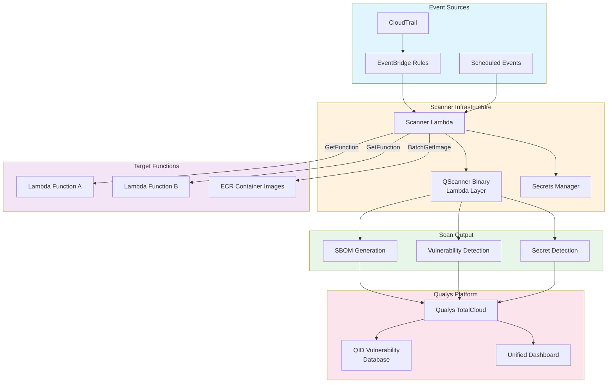
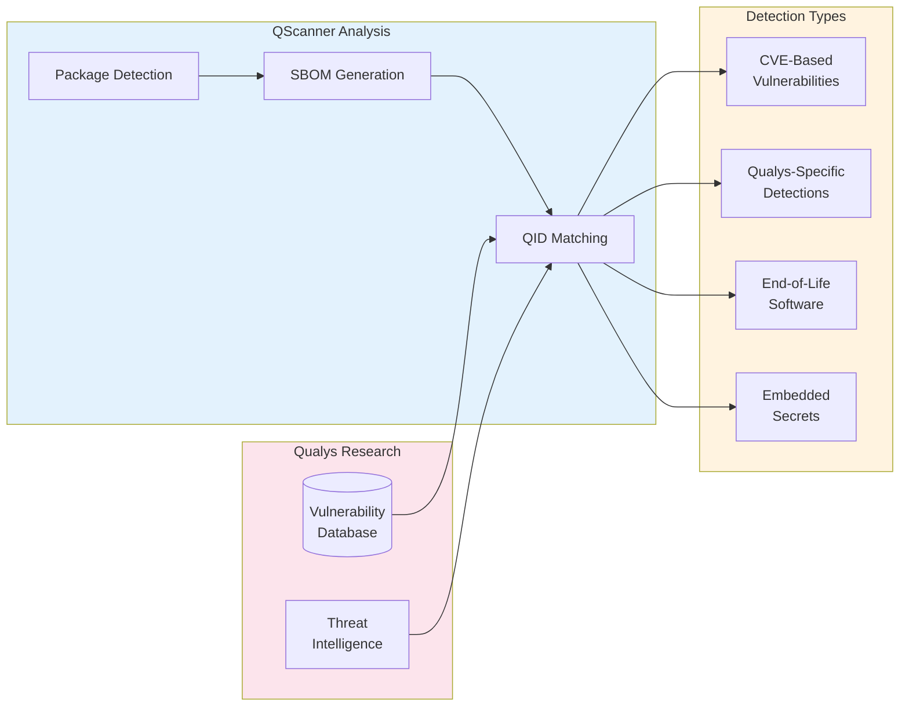
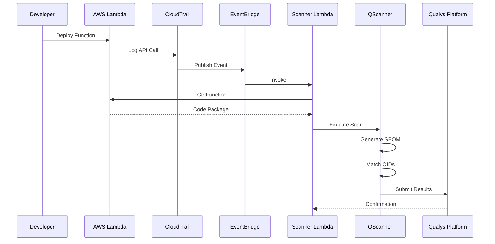
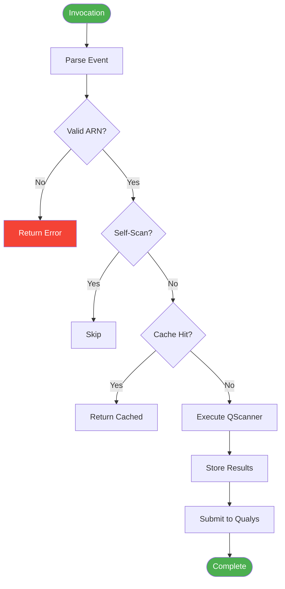
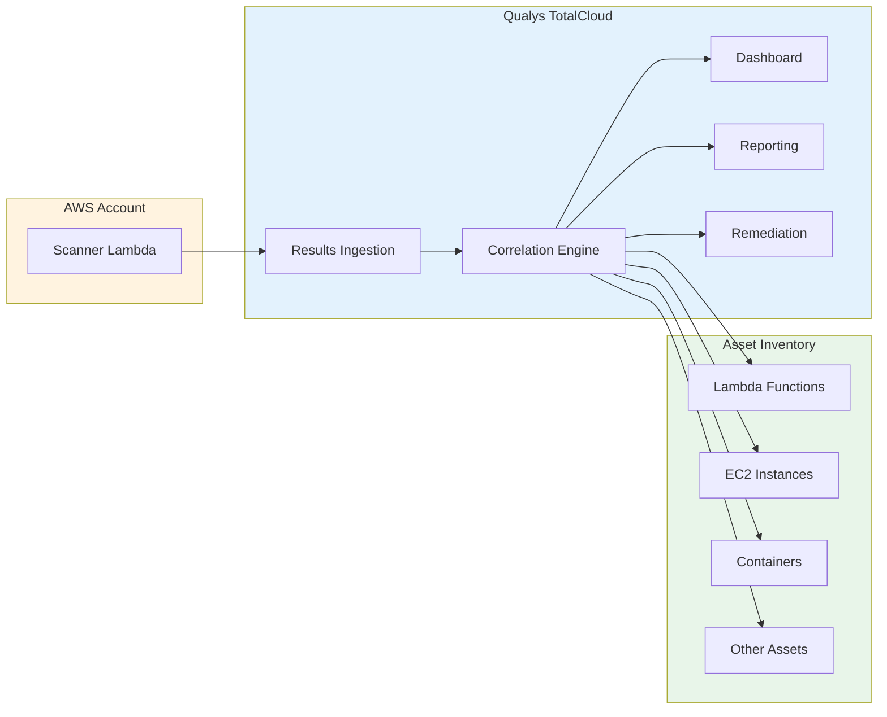
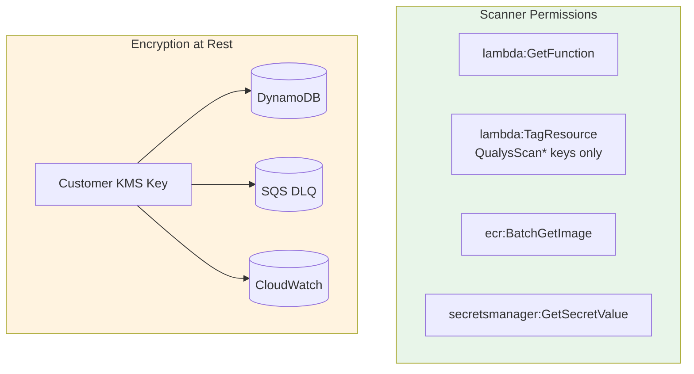

# Agentless Vulnerability Scanning for AWS Lambda with Qualys

Serverless computing has transformed how organizations deploy applications. AWS Lambda powers millions of workloads, but introduces a new security challenge: scanning ephemeral, event-driven functions for vulnerabilities without traditional infrastructure to host an agent.

This post examines the technical architecture behind agentless Lambda scanning powered by Qualys QScanner, covering the event-driven design, vulnerability detection capabilities, and integration patterns.

## The Serverless Security Challenge

Traditional vulnerability scanning relies on persistent agents. This model fails with Lambda due to ephemeral compute, read-only file systems, cold start sensitivity, and dynamic scale. The solution is agentless scanning where an external scanner retrieves and analyzes function code without executing inside the target function.

## Architecture Overview

The architecture combines AWS event services with Qualys QScanner to detect Lambda changes and scan functions automatically:



## Qualys QScanner Capabilities

QScanner is the scanning engine at the core of this architecture. Deployed as a Lambda layer, it provides comprehensive analysis capabilities that leverage the Qualys vulnerability research team's expertise.

### Software Bill of Materials Generation

QScanner performs deep package analysis to generate a complete Software Bill of Materials for each Lambda function. This includes:

- Direct dependencies declared in package manifests (package.json, requirements.txt, go.mod, pom.xml)
- Transitive dependencies resolved through the dependency tree
- System packages in container image layers
- Binary analysis for compiled artifacts

The SBOM provides complete visibility into the software supply chain, enabling organizations to respond rapidly when new vulnerabilities are disclosed.

### Vulnerability Detection with QIDs

Qualys maintains one of the industry's most comprehensive vulnerability databases, with each vulnerability assigned a unique Qualys ID (QID). QScanner maps discovered packages against this database to identify:

- Known CVEs affecting installed package versions
- Qualys-specific vulnerability detections not yet assigned CVEs
- Version-specific security advisories
- End-of-life software with no available patches

The QID system enables precise vulnerability tracking across the enterprise. Security teams can search, filter, and report on specific QIDs across all scanned assets, whether they are Lambda functions, containers, or traditional servers.



### Secret Detection

Beyond vulnerability scanning, QScanner identifies hardcoded secrets and credentials in function code:

- API keys and access tokens
- Database connection strings
- Private keys and certificates
- Cloud provider credentials

This capability is critical for Lambda functions, which often require credentials to access other services and databases.

### Multi-Runtime Support

QScanner supports all major Lambda runtimes:

| Runtime | Package Detection | SBOM Format |
|---------|-------------------|-------------|
| Python | pip, pipenv, poetry | CycloneDX |
| Node.js | npm, yarn | CycloneDX |
| Java | Maven, Gradle | CycloneDX |
| Go | Go modules | CycloneDX |
| .NET | NuGet | CycloneDX |
| Ruby | Bundler | CycloneDX |

Container image-based Lambda functions receive full image layer analysis, scanning both the base image and application layers.

## Event-Driven Trigger Architecture

CloudTrail captures Lambda API calls, and EventBridge routes relevant events to the scanner:



EventBridge rules filter for specific CloudTrail events:

```json
{
  "source": ["aws.lambda"],
  "detail-type": ["AWS API Call via CloudTrail"],
  "detail": {
    "eventSource": ["lambda.amazonaws.com"],
    "eventName": ["CreateFunction20150331", "UpdateFunctionCode20150331v2"]
  }
}
```

## Scanner Processing Flow

The scanner Lambda orchestrates the scan process:



### Code Retrieval

For zip packages, the scanner calls GetFunction to obtain a presigned S3 URL for the deployment package. For container images, it authenticates with ECR and pulls image layers. Neither approach requires invoking the target function.

### Scan Caching

A DynamoDB table caches scan results keyed by function ARN and code SHA256. Unchanged functions skip scanning, reducing compute costs and API calls.

## Integration with Qualys TotalCloud

Scan results flow directly into the Qualys TotalCloud platform, providing:

**Unified Visibility**: Lambda vulnerabilities appear alongside findings from EC2, containers, and other cloud assets in a single dashboard.

**QID-Based Tracking**: Security teams can track specific vulnerabilities across all asset types using consistent QID references.

**Compliance Reporting**: Scan results feed into compliance frameworks and audit reports.

**Remediation Workflows**: Integration with ticketing systems and remediation tracking.



## Security Model

The scanner operates with minimal IAM permissions:



All data at rest uses customer-managed KMS encryption. The scanner cannot invoke or modify target functions beyond adding scan status tags.

## Deployment Options

Infrastructure deploys via CloudFormation or Terraform with configurable parameters:

| Parameter | Description | Default |
|-----------|-------------|---------|
| ScannerMemorySize | Lambda memory allocation | 2048 MB |
| ScannerTimeout | Maximum scan duration | 900 seconds |
| CacheTTLDays | Scan result cache duration | 30 days |
| EnableTagging | Tag functions with scan status | true |
| BulkScanSchedule | Periodic full-account scan | manual |

## Conclusion

Agentless vulnerability scanning addresses the unique challenges of serverless security. By combining AWS event-driven architecture with Qualys QScanner's comprehensive analysis capabilities, organizations gain continuous visibility into Lambda vulnerabilities without impacting function performance.

The integration with Qualys TotalCloud extends this visibility across the entire cloud estate, enabling security teams to manage serverless and traditional workloads through a unified platform backed by industry-leading vulnerability research.
